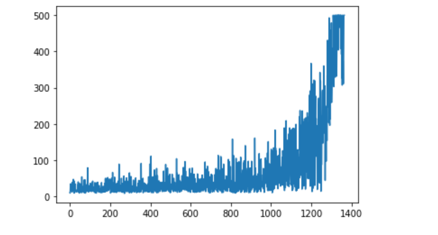

# Cart-Pole-Game-Reinforcement-Learning
Training the agent with DQN algorithm for policy improvement and learning to maintain the balance for longer time

Cart Pole game is balancing a vertical pole by taking action left or right. The motion helps the pole not to fall. 
The aim is to last as long as possible.

The Deep Reinforcement Learning (Deep Learning + Reinforcement Learning) facilitates the algorithm DQN ( Deep Q Network), where the agent 
learns the policy with Q learning with the help of a neural network. 

In order to keep sample IID, first episodes are stored in memory and then episodes are randomly sampled to train the network. 
Freezing the weights for Q target allows network to behave in stabilized manner. 

Below is the learning curve for the agent after each episode. After struggling initially, agent learns to hold up to 500 steps before falling.

